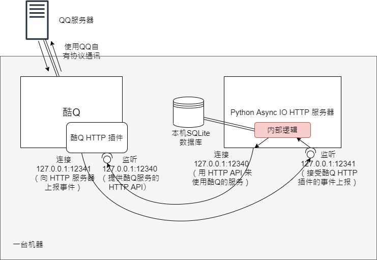
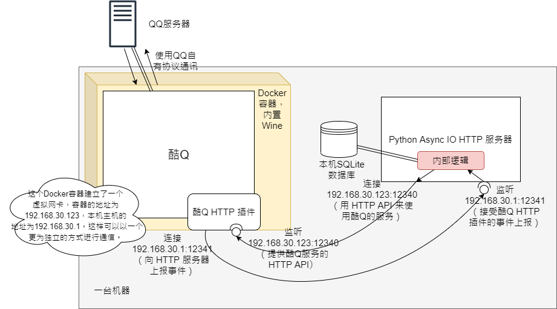
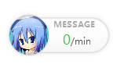
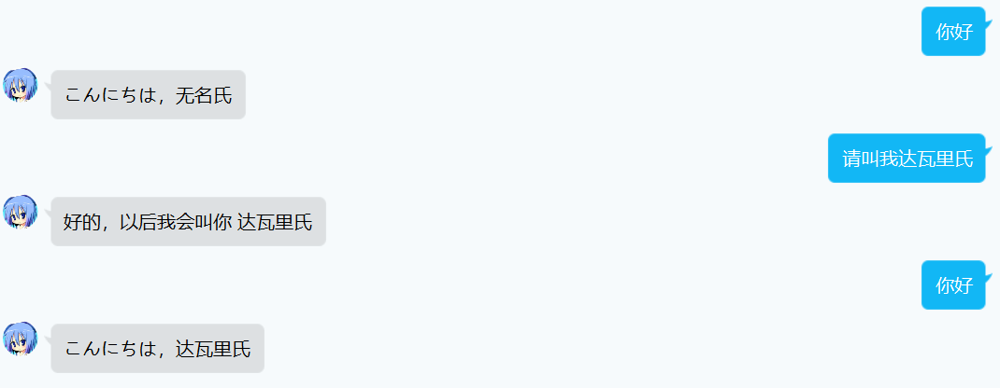
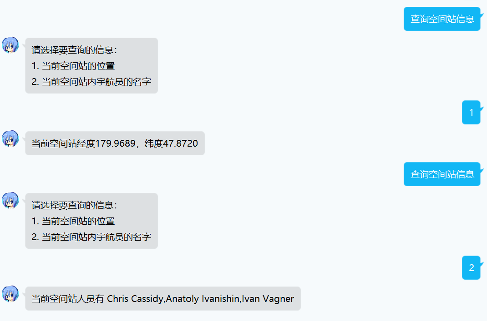
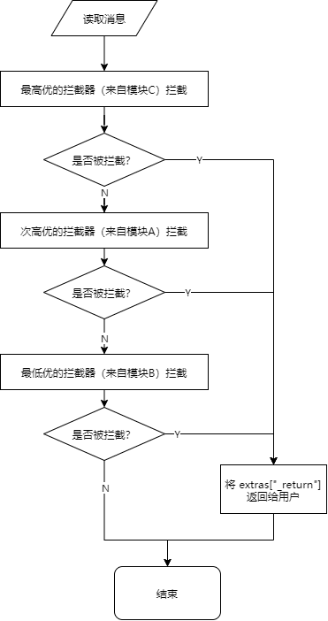

# CEIE-Bot

A simple stateful QQ bot framework based on [python-aiocqhttp](https://github.com/richardchien/python-aiocqhttp/tree/master/aiocqhttp).

Works with CoolQ and its HTTP Plugin.

## 1 原理介绍

当不需要让酷Q在 Docker 容器中运行时（比如 Windows 系统上）：



当需要让酷Q在 Docker 容器中运行时（比如类 UNIX 系统上）：



接下来对各个部分进行介绍。

### 1.1 酷Q

- 官网：https://cqp.cc/
- 最新版直接下载地址（Air 图灵版）：http://dlsec.cqp.me/cqa-tuling
- 酷Q的 Docker 容器镜像 GitHub 地址：https://github.com/CoolQ/docker-wine-coolq
- 酷Q的 Docker 容器镜像 Docker Hub 地址：https://hub.docker.com/r/coolq/wine-coolq

酷Q是一款 Windows 软件，它模拟了腾讯 QQ 安卓端的通讯协议，让它可以作为一个可编程的 QQ 客户端。酷Q可以安装一些插件，拓展它的功能。我们主要用到酷Q的 HTTP 插件。

酷Q可以在 Windows 平台上直接运行。而在 Linux 系统上，则需要安装一个名叫 Wine 的兼容层（https://www.winehq.org/ ）来让 .exe 的可执行文件运行起来。为方便部署，使用 Docker 镜像将酷Q、 Wine 和方便用户进行可视化操作的虚拟桌面服务 NoVNC 合并在一起，使用简单的 `docker run` 命令就可以让酷Q在 Linux 系统上跑起来。

运行方法请查看上述链接中的安装和运行说明。

### 1.2 酷Q HTTP 插件

- 项目 GitHub 主页：https://github.com/richardchien/coolq-http-api
- 最新版直接下载地址：https://github.com/richardchien/coolq-http-api/releases/latest/download/io.github.richardchien.coolqhttpapi.cpk
- 使用文档：https://cqhttp.cc/docs/4.15/#/

把酷Q的服务（如发消息）包装为 HTTP 的接口，把酷Q接收到的事件（如收到消息）通过 HTTP 请求的方式向外传递，实现以 HTTP 的方式双向传送 QQ 消息的数据。

#### 1.2.1 配置项

- 酷Q HTTP 插件的监听地址：例如在图中，监听 127.0.0.1:12340 和 192.168.30.1:12340
- 事件上报地址：事件上报服务器（就是我们将要编写的这个 Python HTTP 服务器）的地址。当酷Q接收到消息等事件后，会连接这个地址发送 HTTP 请求，以实现上报。例如在图中，事件上报地址为 127.0.0.1:12341 和 192.168.30.1:12341

配置方法请参考项目文档中的说明。

### 1.3 Python 异步 HTTP 服务器

这是我们要做的核心内容。虽说这是一个 HTTP 服务器，但是我们采用 python-aiocqhttp 这个 pip 包来进一步抽象它，让 HTTP 请求的收发更为简易。

- 项目的 GitHub 主页：https://github.com/cqmoe/python-aiocqhttp
- 项目的文档：https://python-aiocqhttp.cqp.moe/

### 1.4 Python 异步 HTTP 服务器的内部逻辑

我写了一个机器人框架，实现了以下特性：

- 状态管理
- 模块化
- 优先级管理
- 拦截器的抽象
- 数据（用户变量）的持久化、读取与写入
- 定时任务

现在，为机器人实现一个新功能，在最简单的情况下，只需要做这些事就行了：

- 按照格式创建一个机器人模块，继承 `bot_module.BotModule` 类
- 在 `all_state_function_list` 等类方法中定义拦截器（Interceptor）（在足够简单的情况下，这一步也可以省略，直接继承 `BotModule` 类里面的默认值）
- 在 `all_state_intercept` 等类方法中定义所需要的动作
- 在整个框架的 `config.py` 中添加这个模块，并指定一个基准优先级（Base Priority）
- 重新启动框架

```
import base64
import json
import time
import datetime
import lxml.html
import traceback
import re
from aiocqhttp.message import Message, MessageSegment
import asyncio

from ... import log
from ... import db
from ... import bot_module
from ...bot_module import Interceptor, InputVarAttribute
from ... import const
from ... import util

try:
    from . import config as priv_config
except ImportError:
    from . import config_example as priv_config

class MyBotModule(bot_module.BotModule):
    @classmethod
    async def on_init(cls):
        pass

    @classmethod
    async def all_state_intercept(cls, bot, context, msg, input_vars, update_vars, extras, **kwargs):
        ... 默认的所有状态拦截器动作定义

    @classmethod
    def all_state_function_list(cls, base_priority):
        return [
            Interceptor(
                ... 拦截器定义
            )
        ]

module_class = MyBotModule
```

## 2 安装

### 2.1 确认 Python 版本及环境

- 打开命令提示符或者 bash，运行 `python -V`。
- 确认显示的 Python 版本在 3.7 及以上。

### 2.2 克隆 git 仓库，在仓库内创建 Python 虚拟环境（venv）

- 进入命令提示符或者 bash，切换到你希望创建仓库工作目录的目录下面。
- 使用 `git clone 本仓库地址` 克隆本仓库到本地。
- 使用 `cd bot` 进入仓库的工作目录。
- 用 `python -m venv .\venv`（Windows 下）或者 `python -m venv ./venv`（Linux 下）创建一个虚拟环境（Virtual Environment），虚拟环境的目录为当前目录下的 `venv`。
- 在 bash 下运行 `source ./venv/bin/activate`，或者是在命令提示符下运行 `.\venv\Scripts\activate.bat` 进入虚拟环境。你应该可以看到命令提示符的左侧出现包裹于括号内的虚拟环境名称 `(venv)`。
- 此后你就可以在虚拟环境中相对隔离地进行 Python 包（pip）的安装、Python 脚本的运行了。
- 如果想要退出虚拟环境，直接运行 `deactivate` 即可。

### 2.3 在虚拟环境中安装 pip 依赖

- 确保自己已经进入 venv。
- 执行 `pip install -r requirements.txt`，将 `requirements.txt` 里的依赖装上。如果发现下载过程缓慢，可以参考[清华大学开源软件镜像站的指引](https://mirror.tuna.tsinghua.edu.cn/help/pypi)把 pypi 源的地址设为国内的镜像。

### 2.4 安装酷Q

在 Windows 下，下载和解压酷Q，打开 `CQA.exe` 即可。

在 Linux 下，需要懂 Docker 的基本操作，按照上面容器镜像的使用说明，以 `coolq/wine-coolq` 为镜像并运行酷Q with Wine 的容器。注意要确保用 Docker 的 volume 机制（现在可能改版叫 mount 机制了，详见 Docker 的官方文档）将容器内的 `/home/user/coolq` 路径映射到本机的某个目录，方便持久化以及管理。之后，你需要在浏览器中连接到容器的 NoVNC 服务，在里面去操作酷Q的图形界面。

## 3. 使用

### 3.1 开启酷Q

在开启酷Q之前，先进入酷Q的目录，在 `./app/` 目录下，将下载好的酷Q HTTP API 插件 `io.github.richardchien.coolqhttpapi.cpk` 放进去。

打开酷Q，登录你的 QQ 小号，就可以将小号作为机器人账号。登录过程中可能有手机号验证等安全流程，请按照提示操作。

成功登录后，会有一个“互动式教程”的插件是默认打开的。用另一个 QQ 账号向机器人账号发送“新手教程”，如果看到自动回复以及后续的引导，说明机器人工作正常。可以按照这个教程初步熟悉酷Q的插件操作。


接下来我们启动 CQHTTP 插件。



登录后屏幕上会出现一个悬浮窗，右键-应用-应用管理，在应用列表中找到 CQHTTP 插件，启用它。中间会要求权限，请全部批准。

右键悬浮窗-应用-CQHTTP-打开应用目录，应该会打开 `./data/app/io.github.richardchien.coolqhttpapi` 目录。在这个地方，你就可以按照 https://cqhttp.cc/docs/4.15/#/Configuration 的指示去编写配置文件。最简单的方法是直接打开 `config/<QQ号>.json` 文件进行修改，但之后想要更换 QQ 号时记得重新设置。

我们一般会修改如下配置项：

- 将 `port` 改成需要监听的端口号；以最开始的结构图为例，端口号是 12340
- 将 `post_url` 改成 Python HTTP 服务器将会监听的地址和端口号；以最开始的示意图为例，应该是 `http://127.0.0.1:12341` 或者 `http://192.168.30.1:12341`。

配置编辑完成后，重启酷Q。一般来说，我们之后不会再去动酷Q的配置了，重点放在我们需要编程的这个 HTTP 服务器上。

### 3.2 开启 Python HTTP 服务器

#### 3.2.1 创建配置

进入 bot 的代码目录，进入 `bot/` 目录。将 `config_example.py` 拷贝一份，重命名为 `config.py`。这是整个框架的配置文件。打开它，进行如下修改：

- 设置 `LISTEN_ADDRESS` 和 `LISTEN_PORT` 为要监听的地址和端口。根据最开始的结构图，可设置为 `127.0.0.1` 和 `12341`。
- 设置 `API_URL_PREFIX` 为酷Q HTTP API 插件监听的地址，如 `http://127.0.0.1:12340`
- 设置 `QQ_ADMINISTRATORS` 为本机器人的管理员账号列表。管理员必须和机器人账号是好友。当机器人的某个操作引发了异常后，相关调试信息会自动发送到管理员账号。
  
最重要的是设置 `MODULES` 变量。它是一个列表，每一个元素形如此：
```
{
    "name": "hello",
    "prior_priority": 3000,
    "state_priority": 3000,
    "idle_priority": 3000,
    "all_state_priority": 3000
},
```
表示加载一个模块。如上述配置表示，加载“hello”模块（位于 `./bot/modules/hello/__init__.py`，指定其各种情况下的拦截基础优先级为 3000。

在这里，我们仿照着修改它，让框架加载这两个模块：

- hello
- ask_iss

这是我写的两个教学用示例模块。

当然你还可以去 `./bot/modules/` 下看看其他模块是怎么写的，如向能源管理中心查电费的模块 `electricity_bill` 和实现了爬取丁香园、Telegram 频道的疫情信息并定时自动播报的模块 `pneumonia`、查询天气、定时自动检查和播报天气预警信息的 `weather`，它们的语法和用法都是正确的，但限于需要一些额外的代码修改和配置，目前还不可用。

各个 `_priority` 最好以千为单位，但目前可以随意设置。在各个模块检测的消息不会冲突的情况下，优先级基本是没有什么用的，只需保证每个模块都不同就可以了。

接着，我们进入 `./bot/modules/hello/` 目录下。这个目录有一个 `config_example.py`，这意味着我们还需要额外配置这个模块。同样地，复制一份这个文件，重命名为 `config.py`，编辑它。我们发现一个变量 `HELLO_MESSAGE`，顾名思义是问候语。我们可以把它随便修改一个值看看效果，比如 `"Hello"` 或者 `"こんにちは"`。

好了，现在所有的配置已经完成，我们可以运行这个 Python HTTP 服务器了。

进入命令提示符或者 bash，切换到仓库目录下，进入 venv。执行 `python run.py`，你应该会看到窗口中有一些日志信息持续输出并且程序没有中止。这说明运行成功了。

现在我们尝试测试这两个模块。`hello` 模块纯粹是一个用来打招呼和记录用户名字的模块：



可以看到我们之前的配置项 `HELLO_MESSAGE = "こんにちは"` 在这里生效了。

`ask_iss` 模块是一个交互式的、用来联网查询空间站信息的模块：



基本的安装、运行演示到这里就结束了。你可以去看看这两个模块的 `__init__.py` 是怎么写的；内附了详细的注释。

## 4. 编码

### 4.1 工程结构

**入口** &nbsp;&nbsp; 整个工程运行的入口是 `./run.py`。它非常简单，只是将 `./bot/` 目录以 Python 包的形式导入，之后执行 `bot.framework.main()` 开始运行机器人框架逻辑。

**框架配置** &nbsp;&nbsp; 整个框架的配置文件在 `./bot/config.py`，需要用户手动复制一份 `./bot/config_example.py` 的内容并手动修改来创建。它规定了：

- HTTP 服务器的监听地址
- SQLite 数据库文件的位置
- 要加载的模块

**模块** &nbsp;&nbsp; `./bot/modules` 存放当前可用的模块。每个模块都是一个 Python 包，所以每个模块有一个目录，目录里有 `__init__.py`。每一个 `__init__.py` 里都会定义一个继承了 `bot.bot_module.BotModule` 的类，里面描述了模块的运行逻辑。

当框架配置中配置了需要加载某个模块时，框架开始运行时将会将这些模块导入进来，提取类中定义的拦截器列表到一个全局的列表。这样模块就能生效了

**模块配置** &nbsp;&nbsp; 每一个模块可能也会需要自己的用户配置。我们规定在模块目录下，模块配置的文件名为 `config.py`，同时可以提供一个 `config_example.py` 供用户参考。`config.py` 内定义了一些全局变量，用户需要自行创建并可以自由编辑。

一般来说，模块的开发者只需要按照一定的格式，在 `./bot/modules/` 目录下增加一个模块即可，无需变动框架。

### 4.2 编码中的重点概念

#### 4.2.1 拦截器

在一次对话中，用户发过来的消息只有一条，但可能要识别和处理这条消息的模块却有很多个。因此，提出优先级不同的拦截器的概念。

拦截器是机器人逻辑工作的基础。它可以按照优先级顺序拦截用户消息内容，并作处理。经过简化后，拦截器工作流程如下：



`Interceptor`（拦截器）继承自 `namedtuple("Interceptor", ["priority", "func", "type_rule", "input_vars", "kwargs", "exception_handler"])`，表示对于一条消息元类型的识别规则，以及类型识别符合后需要进行的拦截操作。

根据上述继承的定义，建立一个 `Interceptor` 的方法为

```
Interceptor(优先级数, 拦截器要执行的函数, 消息类型识别规则, 输入变量表, 执行函数时传递的 kwargs, （可选）执行函数时发生异常的处理函数)
```

如：

```
Interceptor(
    base_priority,
    cls.all_state_intercept,
    const.TYPE_RULE_MSG_ONLY,
    {
        "hello_username": InputVarAttribute("无名氏", const.INDIVIDUAL),
    },
    {},
    None,
)
```

表示这个拦截器：

- 优先级数为 `base_priority`
- 识别一条消息的类型有效后对其执行 `cls.all_state_intercept` 函数。每一个函数都必须是符合如下定义的异步函数：
  ```
  async def function(cls, bot, context, msg, input_vars, update_vars, extras, **kwargs):
  ```
  其返回值只能为 `True` 或者 `False`。若为 `True` 表示拦截器成功拦截并处理了此消息；否则不然。

  其中参数的含义：
  - `cls`：一般来说拦截器函数会作为一个类的类方法，`cls` 作为其第一个参数表示当前类。
  - `bot`：使得函数运行过程中可以访问当前的 `CQHttp` 类。关于 `CQHttp` 类请参阅：https://python-aiocqhttp.cqp.moe/#/what-happened#cqhttp-%E7%B1%BB
  - `context`：使得函数运行过程中可以访问当前的 Context （在 `python-aiocqhttp` 的最新版本已经改名叫事件 Event）。关于 `Event` 请参阅：https://python-aiocqhttp.cqp.moe/module/aiocqhttp/event.html
  - `msg`：事实上就是 `context["raw_message"]`。
  - `input_vars`：使得函数运行过程中可以访问到所需要的*用户变量*。由拦截器定义。
  - `update_vars`：使得函数运行过程中可以往里写入需要更新的*用户变量*。
  - `extras`：使得函数运行过程中可以获得一些额外的信息，并且更重要地，可以写入要返回给对方用户的消息。框架最开始会往 `extras` 内设置如下的键值：
    ```
    {
        "_return": None,
        "_msg_strip": （msg 去除首尾空白字符的结果）,
        "_msg_filter"：（msg 去除表情、图片等需要 CQ 码表示的元素后的纯文字）,
    }
    ```
    函数运行过程中，写入 `_return` 的值，可以改变最后回复给用户的消息。写入的值实际上就是 CQHTTP 所定义的[上报响应](https://cqhttp.cc/docs/4.15/#/Post?id=%E4%B8%8A%E6%8A%A5%E8%AF%B7%E6%B1%82%E7%9A%84%E5%93%8D%E5%BA%94%E6%95%B0%E6%8D%AE%E6%A0%BC%E5%BC%8F)，一般格式如下：
    ```
    {
        "reply": （要回复的消息内容）
    }
    ```
    同时，上游写、下游读 `extras`，还可以使上游拦截器能够传递信息给下游拦截器，不过这个用法并不常见。
  - `**kwargs`：使得函数运行过程中可以获得额外需要传递的一些键值对。这些值由拦截器定义和传递。

- 消息类型识别识别规则为 const.TYPE_RULE_MSG_ONLY，其定义为
  ```
    TYPE_RULE_MSG_ONLY = {
        "post_type": ["message"],
        "message_type": ["group", "private"],
        "^sub_type": ["notice"]
    }
  ```
  表示：只允许 post_type 为 message（只允许拦截 QQ 消息）、只允许 message_type 为 group 或者 private（只允许群聊或私聊消息）、只允许非 notice 的 sub_type（即不允许拦截系统通知）。

  当一个键以 `^` 开头时，表示仅当消息的这种元类型的值符合右侧列表中任意一个元素时，判定为不符合消息类型规则；否则表示仅当消息的这种元类型的值符合右侧列表中任意一个元素时，判定为符合消息类型规则。
  

  有关 `post_type` 等键值的含义，请参考酷Q HTTP 插件的上报事件定义：https://cqhttp.cc/docs/4.15/#/Post

- 函数运行过程中需要输入的用户变量只有一个，变量名为 `hello_username`。它的范围为 `INDIVIDUAL`。当数据库此前没有这个值时，创建它，并赋默认值为 `"无名氏"`。
- 执行拦截器函数时传一个空的 `kwargs`（`{}`）。
- 执行拦截器函数发生异常时无需额外的自定义处理（`None`），直接由框架兜底。

#### 4.2.2 用户变量

如果我们想要一个机器人去记住用户的名字，我们可能会想到用一个内部的变量去记录它：

> user: 叫我A  
> bot:  好的（设置 name = "A"）  
> user: 你好  
> bot:  你好，A  

如果我们想要机器人逻辑重启后还能够叫出用户的名字，我们可能会想到用一个数据库（SQLite）去保存这个变量。

但是我们忽略了一个问题：机器人交互的用户有很多。如果不加分辨，那不同用户的名字肯定会在同一个变量内冲突。所以我们需要引入*用户变量*。

用户变量存储于数据库中，每种用户变量有一个确定且全局唯一的名字（如 `"hello_username"`），并且每个会话中都会最多有一份（每一段会话中会有不同的 `"hello_username"`）。这里用“会话”而不是用用户的原因在于，同一个用户可能以私聊的方式与机器人对话，也可能以群聊中说话的方式与机器人对话。这两种会话显然存在差异，需要隔离。

这样的话，可以解决冲突的问题了：

> user1: 叫我A  
> bot:   好的（设置 user1（私聊） 的 hello_username = "A"）  
> （与此同时，在群聊1中）user2: 叫我B
> bot:  好的（设置 user2（在群聊1中）的 hello_username = "B"）  
> user1: 你好  
> bot:   你好，A  
> user2: 你好  
> bot:   你好，B  

同时，很大概率随时会有一个全新的用户 `user3` 来和机器人说“你好”，在素未谋面不知道名字的情况下，机器人需要能正确作出反应。因此每一种用户变量都需要一个默认值，如“无名氏”：

> user3: 你好  
> bot:   你好，无名氏（设置 user3（私聊） 的 hello_username = "无名氏"）  
> user3: 叫我C  
> bot:   好的（设置 user3（私聊） 的 hello_username = "C"） 
> user3: 你好  
> bot:   你好，C  

同时，用户变量还有一个范围的问题。假设在一个群聊中，每个人都能向机器人说话。那么在刚才的用途中，用户变量可以完美地工作：

> （某个群聊中）  
> user4: 叫我D  
> user5: 叫我E  
> bot:   （回应 user4）好的  
> user6: 叫我F  
> bot:   （回应 user5）好的  
> user5: 你好  
> bot:   （回应 user6）好的  
> bot:   （回应 user5）你好，E  
> user4: 你好  
> user6: 你好  
> bot:   （回应 user4）你好，D  
> bot:   （回应 user6）你好，F  

但如果一个群想要利用机器人一起玩一个游戏呢？或者在是群成员可以自由设置某一个群的公告/口号的情况下呢？

> （某个群聊中）  
> user7: 设置本群的口号为“One world, one dream”  
> bot:   好的  
> user8: 本群的口号是什么？  
> bot:   “默认口号”  
> user8: ？？？  
> user9: 设置本群的口号为“Make group great again”  
> bot:   好的  
> user7: 本群的口号是什么？  
> bot:   “One world, one dream”  
> user7: ？？？  
> user9: ？？？  

看，如果我们把用户变量的粒度完全控制到每一个人的话，那么一些群里面公共的数据就没办法共用了。在此提出用户变量的范围概念：

- 当一个用户变量的范围是 `INDIVIDUAL` 的时候，群聊中变量值只为各个用户自身保留；
- 当一个用户变量的范围是 `GROUP` 的时候，群聊中的变量值由整个群共享。

注意：在和机器人私聊的情况下，`INDIVIDUAL` 和 `GROUP` 范围的用户变量没有差别。

前面已经讲到，定义拦截器时，实际上也就定义了需要读取并输入到这个拦截器函数里面的用户变量名、默认值、范围：
```
{
    "hello_username": InputVarAttribute("无名氏", const.INDIVIDUAL),
}
```
在函数内部，向 `update_vars` 这样写入，可以在处理完消息之后更新用户变量：
```
update_vars["hello_username", const.INDIVIDUAL] = "张三"
```
注意用户变量的值永远只能是字符串，因此对其他格式有需求时需要写转换函数。

对读写用户变量的实时性和灵活性有要求者，还可以直接用 `db.get_variable` 和 `db.set_variable`
 这两个函数来实时读写用户变量。

#### 4.2.3 状态

在需要交互的机器人场景中，需要用到状态：

> user1: 查询空间站信息  
> bot:   1. 空间站位置信息  
>        2. 空间站成员信息 （同时将 user1 的状态置为“等待用户选择空间站信息项目”）  
> user1: 查询空间站信息  
> bot:   （应该置之不理）  
> user1: 1  
> bot:   （查询后）空间站目前的经纬度是 XXX,XXX。  

可以看到“状态”的重要性：机器人不应该在等待用户给出选择之前对用户的新一轮询问（“查询空间站信息”）有反应；同时，机器人也不应该平白无故地就会对用户打出的数字“1”和“2”做出反应。在等待用户给出“1”或者“2”时，机器人应该将此用户的状态设置为一个特殊值，使机器人能够正确地响应用户的“1”、“2”而不对其他值作出反应；在状态不为这个特殊值时，机器人不应该对“1”和“2”作出反应。

本机器人框架的状态实际上就是一种*特殊的用户变量*，其用户变量名称固定为 `"state"`。`"state"` 可以有 `INDIVIDUAL` 的值，也可以有 `GROUP` 的值；对两种不同范围的值有需求时，拦截器可按需取用和按需设置。

在最开始，`state` 的默认值必须为 `"idle"`；拦截器函数运行时，只需将 `"state"` 像普通用户变量一样更新值就可以更新状态了。

那么，每个模块如何告知框架，处于哪个状态时，消息需要过哪些拦截器呢？这就是最终的 `BotModule` 派生类要做的事情。

#### 4.2.4 `BotModule` 派生类

每一个模块内含唯一的继承了 `bot.bot_module.BotModule` 的类。我们不会创建这个类的实例；这个类里面的所有函数都是静态函数。因此这里的类只是一个使代码有条理的作用。

这个类里面的方法大多充当拦截器函数；同时类还有如下静态函数，参见 `./bot/bot_module.py`：

- `on_init`，在模块刚加载到框架时被调用；
- `prior_function_list`，超前拦截器列表方法，返回这个模块所属的超前拦截器的列表。
- `idle_function_list`，idle 状态下使用的拦截器列表方法，返回当用户处于 idle 状态下应当使用的拦截器。
- `state_function_mapping`，状态到拦截器的映射方法，返回一个字典，字典的键是状态名，值是拦截器的列表。规定了当用户处于什么状态时，应用哪一些拦截器。
- `all_state_function_list`，任意状态拦截器列表方法，返回无论用户处于哪种状态下都要应用的拦截器的列表。

最终，框架对拦截器的综合处理和应用如下：

- 框架加载所有模块后，将所有模块的 `prior_function_list` 集中到一起，按优先级排序；同样，将 `idle_function_list`、`state_function_mapping`、`all_state_function_list` 也都分别集中，按优先级排序。
- 当处理一条消息时，首先将所有 `prior_function_list` 优先级从高到低应用一遍，有拦截器成功拦截则结束；
- 再根据当前用户的状态情况，将 `state_function_mapping` 对应于当前状态的拦截器列表，按优先级从高到低应用一遍，有拦截器成功拦截则结束；
- 将 `all_state_function_list` 按优先级从高到低应用一遍，有拦截器成功拦截则结束；
- 如果当前状态为 `"idle"`，将 `idle_function_list` 按优先级从高到低应用一遍，有拦截器成功拦截则结束；
- 如果没有任何拦截器做出拦截操作，则忽略此消息。

### 4.3 具体实践

有两个示例模块（有详尽注释），可以学习和模仿：

- hello （实现打招呼和记录每个用户的名字的功能）
- ask_iss （实现交互式问答和联网查询空间站信息返回给用户的功能）
