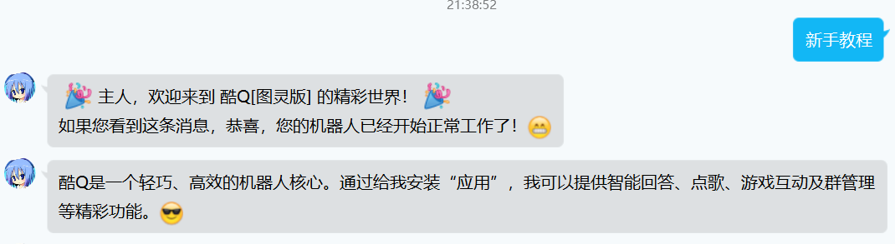

A simple stateful QQ bot framework based on [python-aiocqhttp](https://github.com/richardchien/python-aiocqhttp/tree/master/aiocqhttp).

Works with CoolQ and its HTTP Plugin.

## 1 原理介绍

当不需要让酷Q在 Docker 容器中运行时（比如 Windows 系统上）：


当需要让酷Q在 Docker 容器中运行时（比如类 UNIX 系统上）：


接下来对各个部分进行介绍。

### 1.1 酷Q

- 官网：https://cqp.cc/
- 最新版直接下载地址（Air 图灵版）：http://dlsec.cqp.me/cqa-tuling
- 酷Q的 Docker 容器镜像 GitHub 地址：https://github.com/CoolQ/docker-wine-coolq
- 酷Q的 Docker 容器镜像 Docker Hub 地址：https://hub.docker.com/r/coolq/wine-coolq

酷Q是一款 Windows 软件，它模拟了腾讯 QQ 安卓端的通讯协议，让它可以作为一个可编程的 QQ 客户端。酷Q可以安装一些插件，拓展它的功能。我们主要用到酷Q的 HTTP 插件。

酷Q可以在 Windows 平台上直接运行。而在 Linux 系统上，则需要安装一个名叫 Wine 的兼容层（https://www.winehq.org/）来让 .exe 的可执行文件运行起来。为方便部署，使用 Docker 镜像将酷Q、 Wine 和方便用户进行可视化操作的虚拟桌面服务 NoVNC 合并在一起，使用简单的 `docker run` 命令就可以让酷Q在 Linux 系统上跑起来。

运行方法请查看上述链接中的安装和运行说明。

### 1.2 酷Q HTTP 插件

- 项目 GitHub 主页：https://github.com/richardchien/coolq-http-api
- 最新版直接下载地址：https://github.com/richardchien/coolq-http-api/releases/latest/download/io.github.richardchien.coolqhttpapi.cpk
- 使用文档：https://cqhttp.cc/docs/4.15/#/

把酷Q的服务（如发消息）包装为 HTTP 的接口，把酷Q接收到的事件（如收到消息）通过 HTTP 请求的方式向外传递，实现以 HTTP 的方式双向传送 QQ 消息的数据。

#### 1.2.1 配置项

- 酷Q HTTP 插件的监听地址：例如在图中，监听 127.0.0.1:12340 和 192.168.30.1:12340
- 事件上报地址：事件上报服务器（就是我们将要编写的这个 Python HTTP 服务器）的地址。当酷Q接收到消息等事件后，会连接这个地址发送 HTTP 请求，以实现上报。例如在图中，事件上报地址为 127.0.0.1:12341 和 192.168.30.1:12341

配置方法请参考项目文档中的说明。

### 1.3 Python 异步 HTTP 服务器

这是我们要做的核心内容。虽说这是一个 HTTP 服务器，但是我们采用 python-aiocqhttp 这个 pip 包来进一步抽象它，让 HTTP 请求的收发更为简易。

- 项目的 GitHub 主页：https://github.com/cqmoe/python-aiocqhttp
- 项目的文档：https://python-aiocqhttp.cqp.moe/

### 1.4 Python 异步 HTTP 服务器的内部逻辑

我写了一个机器人框架，实现了以下特性：

- 状态管理
- 模块化
- 优先级管理
- 拦截器的抽象
- 数据（用户变量）的持久化、读取与写入
- 定时任务

现在，为机器人实现一个新功能，在最简单的情况下，只需要做这些事就行了：

- 按照格式创建一个机器人模块，继承 `bot_module.BotModule` 类
- 在 `all_state_function_list` 等类方法中定义拦截器（Interceptor）（在足够简单的情况下，这一步也可以省略，直接继承 `BotModule` 类里面的默认值）
- 在 `all_state_intercept` 等类方法中定义所需要的动作
- 在整个框架的 `config.py` 中添加这个模块，并指定一个基准优先级（Base Priority）
- 重新启动框架

```
import base64
import json
import time
import datetime
import lxml.html
import traceback
import re
from aiocqhttp.message import Message, MessageSegment
import asyncio

from ... import log
from ... import db
from ... import bot_module
from ...bot_module import Interceptor, InputVarAttribute
from ... import const
from ... import util

try:
    from . import config as priv_config
except ImportError:
    from . import config_example as priv_config

class MyBotModule(bot_module.BotModule):
    @classmethod
    async def on_init(cls):
        pass

    @classmethod
    async def all_state_intercept(cls, bot, context, msg, input_vars, update_vars, extras, **kwargs):
        ... 默认的所有状态拦截器动作定义

    @classmethod
    def all_state_function_list(cls, base_priority):
        return [
            Interceptor(
                ... 拦截器定义
            )
        ]

module_class = MyBotModule
```

## 2 安装

### 2.1 确认 Python 版本及环境

- 打开命令提示符或者 bash，运行 `python -V`。
- 确认显示的 Python 版本在 3.7 及以上。

### 2.2 克隆 git 仓库，在仓库内创建 Python 虚拟环境（venv）

- 进入命令提示符或者 bash，切换到你希望创建仓库工作目录的目录下面。
- 使用 `git clone 本仓库地址` 克隆本仓库到本地。
- 使用 `cd bot` 进入仓库的工作目录。
- 用 `python -m venv .\venv`（Windows 下）或者 `python -m venv ./venv`（Linux 下）创建一个虚拟环境（Virtual Environment），虚拟环境的目录为当前目录下的 `venv`。
- 在 bash 下运行 `source ./venv/bin/activate`，或者是在命令提示符下运行 `.\venv\Scripts\activate.bat` 进入虚拟环境。你应该可以看到命令提示符的左侧出现包裹于括号内的虚拟环境名称 `(venv)`。
- 此后你就可以在虚拟环境中相对隔离地进行 Python 包（pip）的安装、Python 脚本的运行了。
- 如果想要退出虚拟环境，直接运行 `deactivate` 即可。

### 2.3 在虚拟环境中安装 pip 依赖

- 确保自己已经进入 venv。
- 执行 `pip install -r requirements.txt`，将 `requirements.txt` 里的依赖装上。如果发现下载过程缓慢，可以参考[清华大学开源软件镜像站的指引](https://mirror.tuna.tsinghua.edu.cn/help/pypi)把 pypi 源的地址设为国内的镜像。

### 2.4 安装酷Q

在 Windows 下，下载和解压酷Q，打开 `CQA.exe` 即可。

在 Linux 下，需要懂 Docker 的基本操作，按照上面容器镜像的使用说明，以 `coolq/wine-coolq` 为镜像并运行酷Q with Wine 的容器。注意要确保用 Docker 的 volume 机制（现在可能改版叫 mount 机制了，详见 Docker 的官方文档）将容器内的 `/home/user/coolq` 路径映射到本机的某个目录，方便持久化以及管理。之后，你需要在浏览器中连接到容器的 NoVNC 服务，在里面去操作酷Q的图形界面。

## 3. 使用

### 3.1 开启酷Q

在开启酷Q之前，先进入酷Q的目录，在 `./app/` 目录下，将下载好的酷Q HTTP API 插件 `io.github.richardchien.coolqhttpapi.cpk` 放进去。

打开酷Q，登录你的 QQ 小号，就可以将小号作为机器人账号。登录过程中可能有手机号验证等安全流程，请按照提示操作。

成功登录后，会有一个“互动式教程”的插件是默认打开的。用另一个 QQ 账号向机器人账号发送“新手教程”，如果看到自动回复以及后续的引导，说明机器人工作正常。可以按照这个教程初步熟悉酷Q的插件操作。



接下来我们启动 CQHTTP 插件。


登录后屏幕上会出现一个悬浮窗，右键-应用-应用管理，在应用列表中找到 CQHTTP 插件，启用它。中间会要求权限，请全部批准。

右键悬浮窗-应用-CQHTTP-打开应用目录，应该会打开 `./data/app/io.github.richardchien.coolqhttpapi` 目录。在这个地方，你就可以按照 https://cqhttp.cc/docs/4.15/#/Configuration 的指示去编写配置文件。最简单的方法是直接打开 `config/<QQ号>.json` 文件进行修改，但之后想要更换 QQ 号时记得重新设置。

我们一般会修改如下配置项：

- 将 `port` 改成需要监听的端口号；以最开始的结构图为例，端口号是 12340
- 将 `post_url` 改成 Python HTTP 服务器将会监听的地址和端口号；以最开始的示意图为例，应该是 `http://127.0.0.1:12341` 或者 `http://192.168.30.1:12341`。

配置编辑完成后，重启酷Q。一般来说，我们之后不会再去动酷Q的配置了，重点放在我们需要编程的这个 HTTP 服务器上。

### 3.2 开启 Python HTTP 服务器

#### 3.2.1 创建配置

进入 bot 的代码目录，进入 `bot/` 目录。将 `config_example.py` 拷贝一份，重命名为 `config.py`。这是整个框架的配置文件。打开它，进行如下修改：

- 设置 `LISTEN_ADDRESS` 和 `LISTEN_PORT` 为要监听的地址和端口。根据最开始的结构图，可设置为 `127.0.0.1` 和 `12341`。
- 设置 `API_URL_PREFIX` 为酷Q HTTP API 插件监听的地址，如 `http://127.0.0.1:12340`
- 设置 `QQ_ADMINISTRATORS` 为本机器人的管理员账号列表。管理员必须和机器人账号是好友。当机器人的某个操作引发了异常后，相关调试信息会自动发送到管理员账号。
  
最重要的是设置 `MODULES` 变量。它是一个列表，每一个元素形如此：
```
{
    "name": "hello",
    "prior_priority": 3000,
    "state_priority": 3000,
    "idle_priority": 3000,
    "all_state_priority": 3000
},
```
表示加载一个模块。如上述配置表示，加载“hello”模块（位于 `./bot/modules/hello/__init__.py`，指定其各种情况下的拦截基础优先级为 3000。

在这里，我们仿照着修改它，让框架加载这两个模块：

- hello
- ask_iss

这是我写的两个教学用示例模块。

当然你还可以去 `./bot/modules/` 下看看其他模块是怎么写的，如向能源管理中心查电费的模块 `electricity_bill` 和实现了爬取丁香园、Telegram 频道的疫情信息并定时自动播报的模块 `pneumonia`、查询天气、定时自动检查和播报天气预警信息的 `weather`，它们的语法和用法都是正确的，但限于需要一些额外的代码修改和配置，目前还不可用。

各个 `_priority` 最好以千为单位，但目前可以随意设置。在各个模块检测的消息不会冲突的情况下，优先级基本是没有什么用的，只需保证每个模块都不同就可以了。

接着，我们进入 `./bot/modules/hello/` 目录下。这个目录有一个 `config_example.py`，这意味着我们还需要额外配置这个模块。同样地，复制一份这个文件，重命名为 `config.py`，编辑它。我们发现一个变量 `HELLO_MESSAGE`，顾名思义是问候语。我们可以把它随便修改一个值看看效果，比如 `"Hello"` 或者 `"こんにちは"`。

好了，现在所有的配置已经完成，我们可以运行这个 Python HTTP 服务器了。

进入命令提示符或者 bash，切换到仓库目录下，进入 venv。执行 `python run.py`，你应该会看到窗口中有一些日志信息持续输出并且程序没有中止。这说明运行成功了。

现在我们尝试测试这两个模块。`hello` 模块纯粹是一个用来打招呼和记录用户名字的模块：


可以看到我们之前的配置项 `HELLO_MESSAGE = "こんにちは"` 在这里生效了。

`ask_iss` 模块是一个交互式的、用来联网查询空间站信息的模块：


基本的安装、运行演示到这里就结束了。你可以去看看这两个模块的 `__init__.py` 是怎么写的；内附了详细的注释。

**以下内容还未完成**

**以下内容还未完成**

**以下内容还未完成**

## Interceptor

`Interceptor`（拦截器）继承自 `namedtuple("Interceptor", ["priority", "func", "type_rule", "input_vars", "kwargs", "exception_handler"])`，表示对于一条消息元类型的识别规则，以及类型识别符合后需要进行的拦截操作。

根据上述继承的定义，建立一个 Interceptor` 的方法为

```
Interceptor(优先级数, 拦截器要执行的函数, 消息类型识别规则, 输入变量表, 执行函数时传递的 kwargs, （可选）执行函数时发生异常的处理函数)
```

如：

```
Interceptor(base_priority + 1, cls.intercept_powerbill, const.TYPE_RULE_MSG_ONLY, {
                "powerbill_i_viewStateStr_saved": InputVarAttribute("null", const.INDIVIDUAL),
                "powerbill_i_campus_saved": InputVarAttribute("null", const.INDIVIDUAL),
                "powerbill_i_building_saved": InputVarAttribute("null", const.INDIVIDUAL),
                "powerbill_i_floor_saved": InputVarAttribute("null", const.INDIVIDUAL),
                "powerbill_i_room_saved": InputVarAttribute("null", const.INDIVIDUAL),
                "powerbill_i_final_location": InputVarAttribute("", const.INDIVIDUAL),
            }, {"prefix": "powerbill_i_", "var_scope": const.INDIVIDUAL}, cls.handle_exception)
```

表示这个拦截器：

- 优先级数为 `base_priority + 1`
- 识别一条消息的类型有效后对其执行 `cls.intercept_powerbill` 函数，参数列表参见 **TODO: 1**
- 消息类型识别识别规则为 const.TYPE_RULE_MSG_ONLY，其定义为
  ```
    TYPE_RULE_MSG_ONLY = {
        "post_type": ["message"],
        "message_type": ["group", "private"],
        "^sub_type": ["notice"]
    }
  ```
  参看酷Q